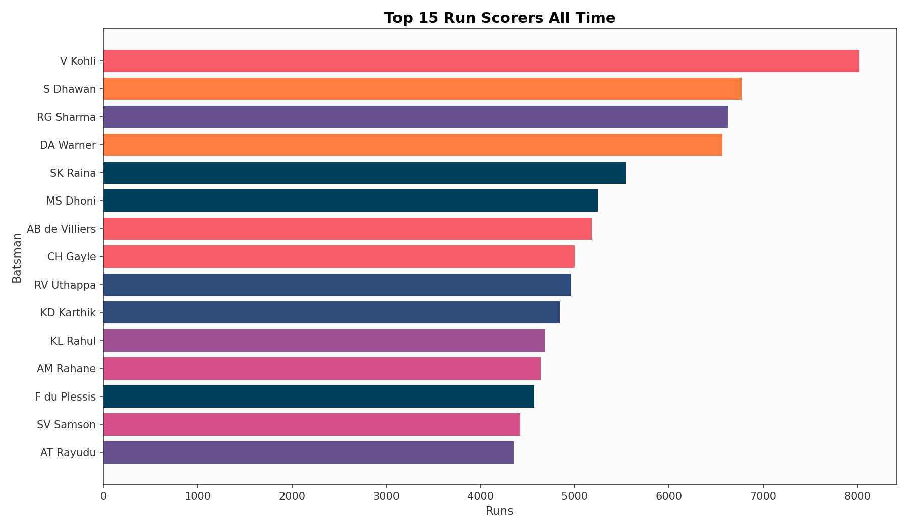
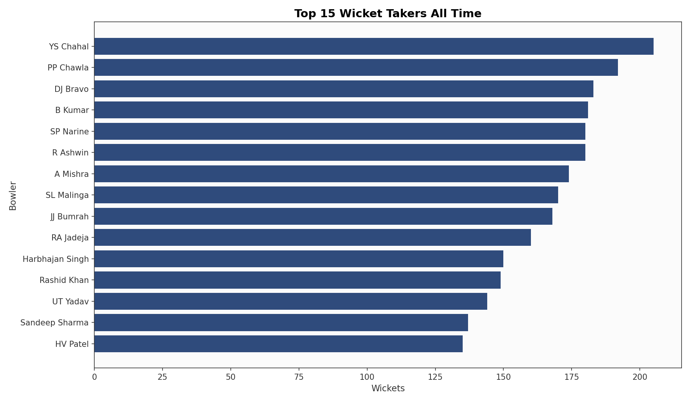
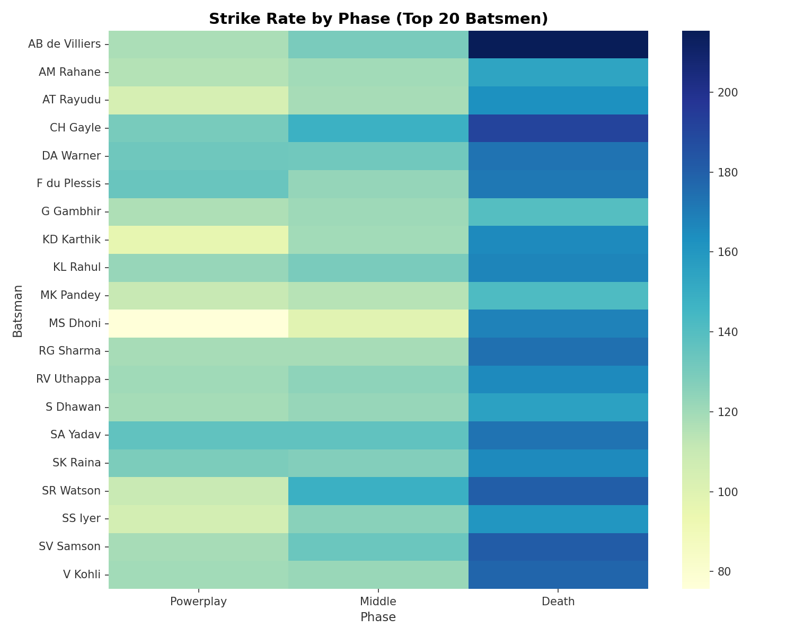
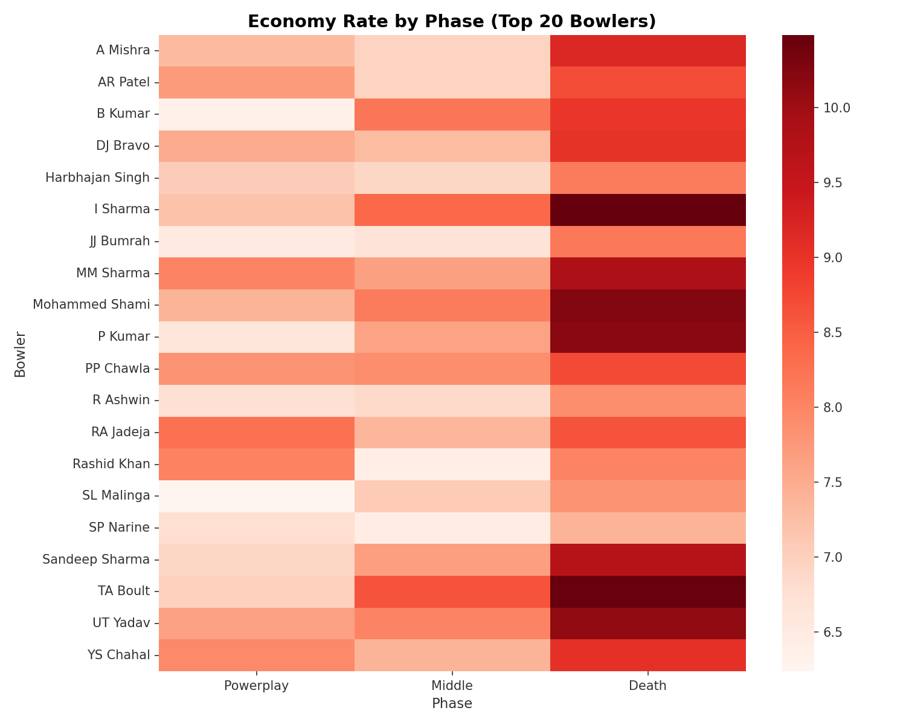
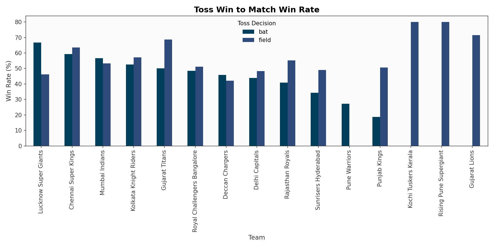
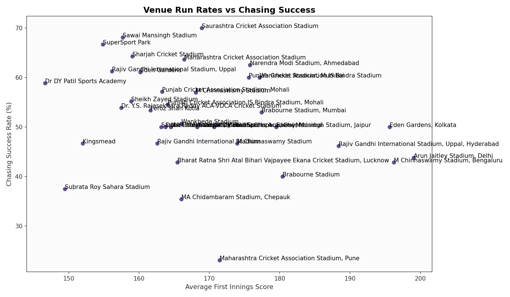
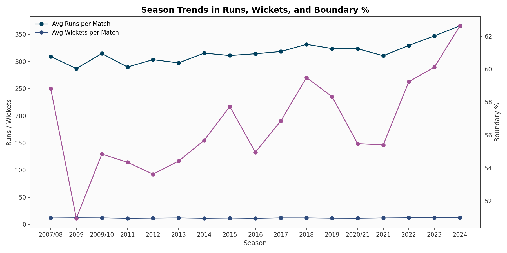
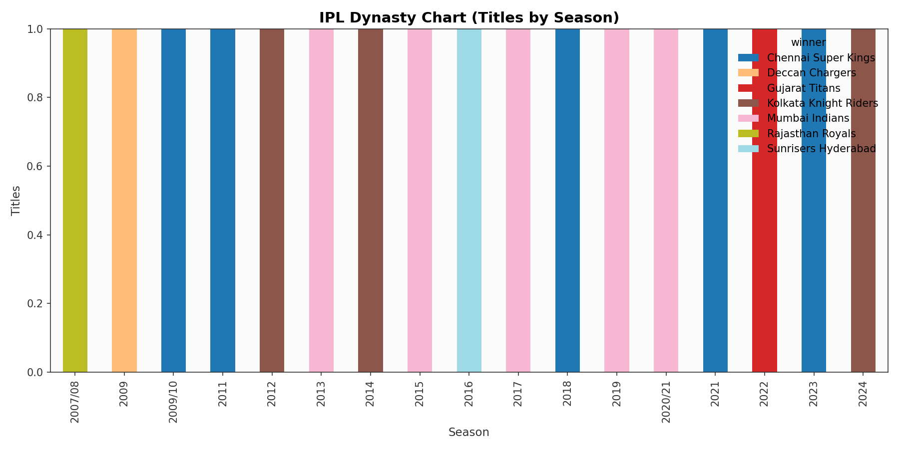
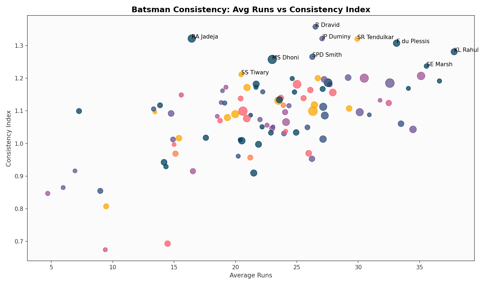
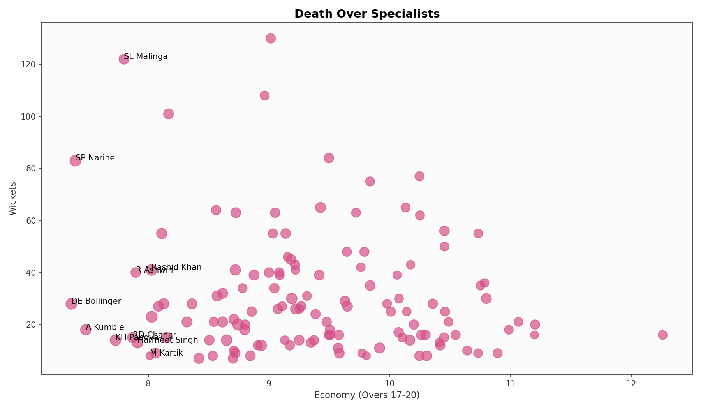

# IPL Analytics (2008-2024)

A portfolio-ready analytics suite that transforms IPL match and ball-by-ball data into SQL insights, Python analysis, and a Streamlit dashboard.


## Problem Statement
Cricket boards and franchises need evidence-backed decisions on player selection, match strategy, and venue tactics. This project answers key questions on batting consistency, bowling pressure, and team strategy across IPL seasons. It combines match metadata with ball-by-ball events to reveal phase-wise performance, toss impact, and venue trends. The results support scouting, tactical planning, and opponent-specific preparation.

## Key Insights
- Batsmen with tenure > 5 seasons show 138.4% higher variance in scoring than shorter-tenure peers.
- Teams winning the toss chose to field 78.19% of the time post-2016.
- Death over economy below 9.29 correlates with a 27.63 percentage-point higher win rate.
- Powerplay scores for winning teams are 5.71 runs higher on average.
- Chasing success rate drops to 12.59% when required run rate exceeds 14.
- Arun Jaitley Stadium, Delhi has the highest first-innings average of 199.06 runs.

## Tech Stack

| Layer | Tools |
| --- | --- |
| Language | Python |
| Data | Pandas, NumPy |
| SQL | SQLite |
| Viz | Matplotlib, Seaborn, Plotly |
| App | Streamlit |

## Project Structure

```
ipl-analytics/
├── data/
│   └── raw/
│       ├── matches.csv
│       └── deliveries.csv
├── sql/
│   ├── schema.sql
│   ├── batting_analysis.sql
│   ├── bowling_analysis.sql
│   └── team_strategy.sql
├── src/
│   ├── data/
│   │   └── load_data.py
│   ├── analysis/
│   │   ├── batting.py
│   │   ├── bowling.py
│   │   └── team_strategy.py
│   └── viz/
│       └── plots.py
├── dashboard/
│   └── app.py
├── results/
│   └── (generated plots go here)
├── notebooks/
│   └── eda.ipynb
├── requirements.txt
├── .gitignore
└── README.md
```

## SQL Highlights

```sql
-- Orange Cap Race by Season
WITH runs_by_season AS (
    SELECT season, batsman, SUM(batsman_runs) AS total_runs
    FROM deliveries
    GROUP BY season, batsman
), ranked AS (
    SELECT season, batsman, total_runs,
           ROW_NUMBER() OVER (PARTITION BY season ORDER BY total_runs DESC) AS rn
    FROM runs_by_season
)
SELECT season, batsman, total_runs
FROM ranked
WHERE rn = 1
ORDER BY season;
```

```sql
-- Death Over Specialists
WITH base AS (
    SELECT
        bowler,
        total_runs - COALESCE(bye_runs, 0) - COALESCE(legbye_runs, 0) - COALESCE(penalty_runs, 0) AS runs_conceded,
        CASE WHEN COALESCE(wide_runs, 0) = 0 AND COALESCE(noball_runs, 0) = 0 THEN 1 ELSE 0 END AS legal_ball,
        CASE WHEN total_runs = 0 THEN 1 ELSE 0 END AS dot_ball,
        CASE WHEN is_wicket = 1 THEN 1 ELSE 0 END AS wicket
    FROM deliveries
    WHERE over BETWEEN 16 AND 20
)
SELECT bowler,
       6.0 * SUM(runs_conceded) / NULLIF(SUM(legal_ball), 0) AS death_economy,
       SUM(wicket) AS wickets,
       100.0 * SUM(dot_ball) / NULLIF(SUM(legal_ball), 0) AS dot_ball_pct
FROM base
GROUP BY bowler
HAVING SUM(legal_ball) / 6.0 >= 20
ORDER BY death_economy ASC;
```

```sql
-- Win Probability by Run Rate
WITH innings_totals AS (
    SELECT match_id, inning, SUM(total_runs) AS runs
    FROM deliveries
    GROUP BY match_id, inning
), targets AS (
    SELECT match_id, runs + 1 AS target
    FROM innings_totals
    WHERE inning = 1
), over_runs AS (
    SELECT match_id, inning, over, SUM(total_runs) AS runs_in_over
    FROM deliveries
    WHERE inning = 2
    GROUP BY match_id, inning, over
), over_cum AS (
    SELECT
        o.match_id,
        o.over,
        SUM(o.runs_in_over) OVER (PARTITION BY o.match_id ORDER BY o.over) AS runs_scored,
        (20 - o.over) AS overs_left
    FROM over_runs o
)
SELECT *
FROM over_cum;
```

## Visualisations












## How to Run

1. Install dependencies
   ```bash
   pip install -r requirements.txt
   ```
2. Place the Kaggle CSVs in data/raw/
   - matches.csv
   - deliveries.csv
3. Load and clean data
   ```bash
   python src/data/load_data.py
   ```
4. Run analyses
   ```bash
   python src/analysis/batting.py
   python src/analysis/bowling.py
   python src/analysis/team_strategy.py
   ```
5. Generate plots
   ```bash
   python src/viz/plots.py
   ```
6. Launch dashboard
   ```bash
   streamlit run dashboard/app.py
   ```

## Deployment Guide

### Streamlit Community Cloud (recommended)
1. Push the repo to GitHub (already done).
2. Go to https://share.streamlit.io and sign in with GitHub.
3. Click "New app" and set:
    - Repository: shubham000111222/IPL-analytics
    - Branch: main
    - Main file path: [dashboard/app.py](dashboard/app.py)
4. Click "Deploy".

### Common Deploy Checks
- Ensure dependencies are listed in [requirements.txt](requirements.txt).
- Keep the CSVs in [data/raw](data/raw) so the app can load them offline.
- If the app fails on first run, restart it after the initial build.

## Dataset
Kaggle IPL dataset (2008-2024/2025): https://www.kaggle.com/datasets/patrickb1912/ipl-complete-dataset-20082020/data

## Notes
- Update the Key Insights section after running the analysis scripts to insert the real numbers.
- Results plots are committed to the repo for quick viewing.


## Author

**Shubham Kumar** · NIT Delhi, CSE (3rd Year)  
[GitHub](https://github.com/shubham000111222) · [Portfolio](https://data-science-portfolio-three-olive.vercel.app)
[LinkedIn](https://linkedin.com/in/shubham-kumar-288b7437b)